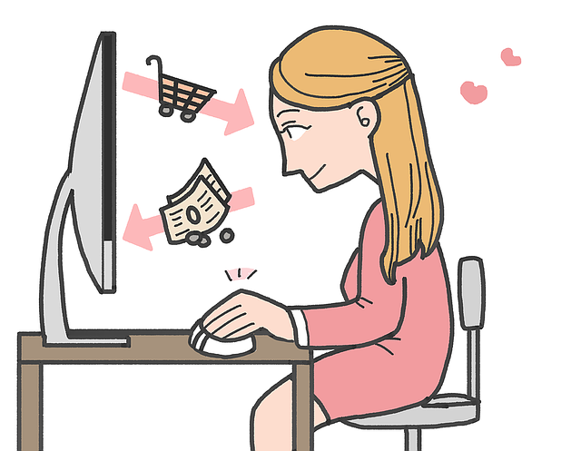

# Recommend Products to Instacart Customers

### Introduction:
Shopping online is fun. It has a lot of advantages! 
* It's open 24*7
* No more worry for parking or getting dressed
* Thousands of options to explore
* No more judging by people while you return

Now, Grocery Shopping is something where we worry about the feshness of the produce items while buying online. How about someone else is doing the shopping for you from one of your favorite shop and deliver at your doorsteps? Sounds intersting, right?  For this service, **Instacart** is the answer!

#### How does it work? 

Customers place orders online through a Mobile app or using the website to be fulfilled from one of their grocery retail partners as per the location. A personal shopper engaged by Instacart picks the items in the store and delivers them in as little as an hour or at the time the customer selects while placing an order.

### Data:
For this project, I am using the Dataset from “The Instacart Online Grocery Shopping Dataset 2017”, Accessed from https://www.instacart.com/datasets/grocery-shopping-2017 on 07/10/2019. 

This anonymized dataset contains a sample of over 3 million grocery orders from more than 200,000 Instacart users. For each user, the dataset provides between 4 and 100 of their orders, with the sequence of products purchased in each order. It also provides the week and hour of day the order was placed, and a relative measure of time between the orders.

### Problem to Solve:
**Build a Shopping Recommendation Engine for Instacart Customers**

Our options are limitless and browsing through those endless choices of products are tiresome. Recommendation helps customers to find products without putting much efforts. 
What to eat, which movie to watch, what book to read or which product to buy are the questions that we find ourselves to answer all the time. Traditionally, these questions are answered with peer recommendations(friends, family, forums, blog posts or reviews) . But these traditional methods are limited and biased. So, how about getting an unbiased answer?

In this project, I want to explore customer shopping behavior by analyzing their pervious purchases and build a shopping Recommendation Engine that could give them a **tailored shopping experience** to drive engagement. In this Dataset, we do not have any Feedback/Rating for any of the items brought by the customer. That means, we have **Implicit Data** and Recommendation Engine has to be built only focussing on user's purchase history. 

### Project Design
Before Fitting any Model or telling a story, we need to explore and understand the dataset. So, first, let's take a peek at our Data and then try out some Machine Learning Algorihms to build a **Recommender System** :
1. [Prform Data Cleaning and Features Extraction](https://github.com/Oindrila-Sen/Springboard/blob/master/Capstone2/Instacart/Instacart_Analysis.ipynb)
2. [Analyze customer behavior by Exploratory Data Analysis (EDA)](https://github.com/Oindrila-Sen/Springboard/blob/master/Capstone2/Instacart/Instacart_EDA.ipynb)
3. [Build Recommendation Engine using ALS and Cosine Similarity Algorithms](https://github.com/Oindrila-Sen/Springboard/blob/master/Capstone2/Instacart/Instacart_Recommend_1.ipynb)
4. [Build Recommendation Engine using Customer Classification](https://github.com/Oindrila-Sen/Springboard/blob/master/Capstone2/Instacart/Instacart_Recommend_2.ipynb)

### Conclusion
Often, I bought a product which I had no plans buying. That's the beauty of Recommendations!
Personally, as a frequent buyer, I do not beleive that Recommendations has to be related to the shopping history of the Customer. That way, the customer tends to buy similar products and dont get a chance to explore a style or another item. Sometimes, I browse products without any intention of buying.It often happens, that while browsing a Dress, I end up buying a Vegetable chopper that had popped up as a Recommendation.

The Online Shopping Portals take different approach for Recommendation based on their data model. Recommendation is tricky when there is no Rating from the customer, but only their shopping history. So, I personally beleive, there should be different levels of Recommendations like **"trending products", "Other customers buying products", "unique unexplored products", "the products that goes well with the already purchased products" or "products other similar customers are buying"**. 
That's what I have tried in this project - Recommending different products to Instacart Customers.

Thank You for Reading!

